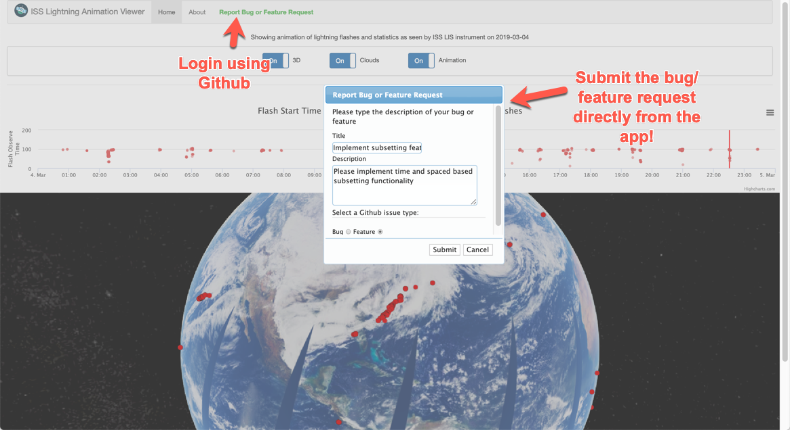

# Lightning Data Viewer

This repository contains the source code to the Lightning Data Viewer. This viewer uses data collected by Lightning Imaging Sensor (LIS) installed on International Space Station (ISS).


Currently the viewer provides ability to view only sample data collected by ISS LIS instrument during March 4th 2019 Tornado Outbreak in Alabama, Huntsville.

### Screenshot:


Please file report bug and feature requests directly from the app [https://lightning-data-viewer.appspot.com/report](https://lightning-data-viewer.appspot.com/report). You will need to login using Github.


### Requirements
The source code requires Python 3.6+. Individual package requirements are mentioned in requirements.txt file

### Running
Rename sample.config.py file to config.py file and change values for
- Cesium Token
- Github Client ID
- Github Client Secret
- Github Access Key
- Fullstory Org Code
- Fullstory API Key
- Custom secret key

Create Python virtual environment. Please refer [Python Docs](https://docs.python.org/3/library/venv.html) for more info
```bash
python3 -m venv venv
source venv/bin/activate
```
Then install Python dependencies
```bash
pip install -r requirements.txt
```

Run the unit tests
```bash
pytest
```

If all tests are passing, start the Flask app
```bash
python app.py
```

You should now see app running at [http://localhost:5000/](http://localhost:5000/)

### Github Integration
- Goto https://github.com/settings/apps/new
- Fill the form with following information
    - Homepage URL: http://localhost:5000
    - User authorization callback URL: http://localhost:5000/github-callback

### Source Code Organization
- app.py - main application routes 
- db.py - database schema and database helper function 
- read_data.py - code to read ISS LIS NetCDF data files
- helper.py - helper functions
- static/css - application's CSS styles
- static/js - application's JavaScript files
- static/lib - application's libraries
- templates - HTML templates
- tests - unit tests for the application

## Deployment
This application is currently deployed to Digital Ocean. Please follow instructions mentioned [here](https://www.digitalocean.com/community/tutorials/how-to-serve-flask-applications-with-uswgi-and-nginx-on-ubuntu-18-04) to setup this application on a Digital Ocean droplet.

## Future Work
- Add ISS Orbits
- Ability to download data points
- View more ISS LIS data products
- Integration with PostGIS
- Integration with GeoServer
- Make integration with Github and Fullstory optional
- Add more unit tests for backend
- Add unit tests for frontend 
- Add integration test
- Configure CD/CI system for this app
- Better organization of code

## License
This application's code is licensed under MIT license. The individually used libraries are licensed under their own respective licenses.

## Credits
Sample ISS LIS data is obtained from NASA GHRC DAAC. Citation is as below -
```
Blakeslee, Richard J.. 2017. NRT Lightning Imaging Sensor (LIS) on International Space Station (ISS) Provisional Science Data [indicate subset used]. Dataset available online from the NASA Global Hydrology Resource Center DAAC, Huntsville, Alabama, U.S.A. 
DOI: http://dx.doi.org/10.5067/LIS/ISSLIS/DATA205
```
